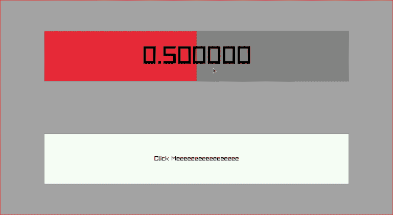

A set of widgets for building simple user interfaces in raylib

features:
* row, column, grid layouts
* buttons, labels, sliders, checkboxes
* fade-in/out
* texture support

example:
```c++
// from ./example/main.cpp

// define the widgets
RayWidget* ui      = nullptr;
auto       mainCol = new RayCol;
auto       slider  = new RaySlider;
auto       button  = new RayTextButton("Click Meeeeeeeeeeeeeeeee");

// set the widget hierarchy
ui = mainCol->add({
    slider,
    button,
});

// apply some properties
RayWidgetState{
    .border = {GRAY, 1}}
    .applyTo({slider, button});

mainCol->widgetState.bbox            = {0, 0, 0.5, 0.5};
mainCol->widgetState.backgroundColor = {20, 20, 20, 100};
mainCol->layoutState.padding         = {20, 20, 20, 20};
mainCol->layoutState.spacing         = 10;
// ...

while (!WindowShouldClose())
{
    auto sw = (float)GetScreenWidth();
    auto sh = (float)GetScreenHeight();

    BeginDrawing();
    ClearBackground(WHITE);

    // run the widget on the given surface
    ui->setSurface({0, 0, sw, sh});
    ui->run();

    EndDrawing();
}
```

